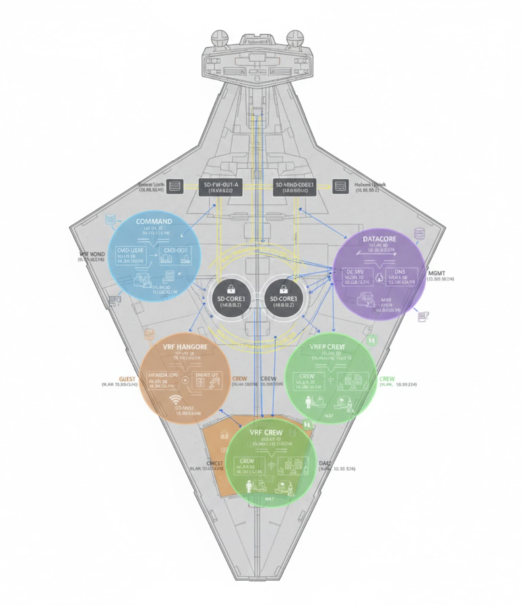

# Star Destroyer Enterprise Network -

This repository contains a fully fictional, enterprise network design based on an **Imperial I‑class Star Destroyer**. It is structured like a real corporate network (HQ, datacenter, branch sites, DMZ, WAN edge) but uses Star Wars–themed naming to showcase routing, switching, security, and operations skills without revealing any confidential information or resemblence to an enterprise network. I wanted to create something that could enable me to practice designing a fully functional lab, while also enjoying the elaborate process, this is where my Star Destroyer Enterprise Network was born; for demo purposes, the topology is entirely fictional and is not intended to represent an actual network topology within a Star Destroyer as this is simply a work of my own.

## Image of the Star Destroyer Network Topology

  

## Highlights for this Project:

- Hierarchical campus design (core, distribution, access) to keep everything simplified
- Segmentation using VLANs, security zones, and optional VRFs
- Dynamic routing with OSPF and BGP
- Redundant gateways using HSRP/VRRP
- Perimeter security with firewalls and a Holonet edge router
- Centralized logging, monitoring, and IP addressing/VLAN planning
- Professional MOP and post-validation checklist

## Repository Structure

- `topology/`
  - Logical and physical topology diagram (Star Destroyer network)
  - IP addressing and VLAN/segmentation plans
- `configs/`
  - Device configs by functional area (Command Sector, Data Core, Hangar, Crew, Guest, Holonet Edge)
  - Reusable core router template
- `documentation/`
  - Network architecture overview and included diagrams
  - Method of Procedure (MOP) for deployment
  - Post-validation checklist

## Closure & Commentary

- This personal project was solely created out of interest of exploring L2 / L3 hierarchy in an enterprise setting, as creating the topology, while establishing a workflow for how this could be built-out in a Star Destroyer was the real-deal. 

**Disclaimer**: All names, IP addresses, and systems are fictional and created solely for demonstration, as again I wanted to create an enterprise network complete with all interworking appendages. If you have any feedback or would like to suggest improvements to this current process, please let me know!
